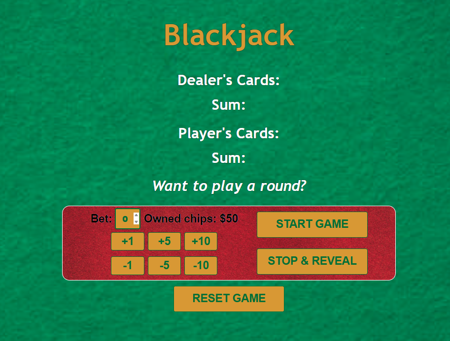
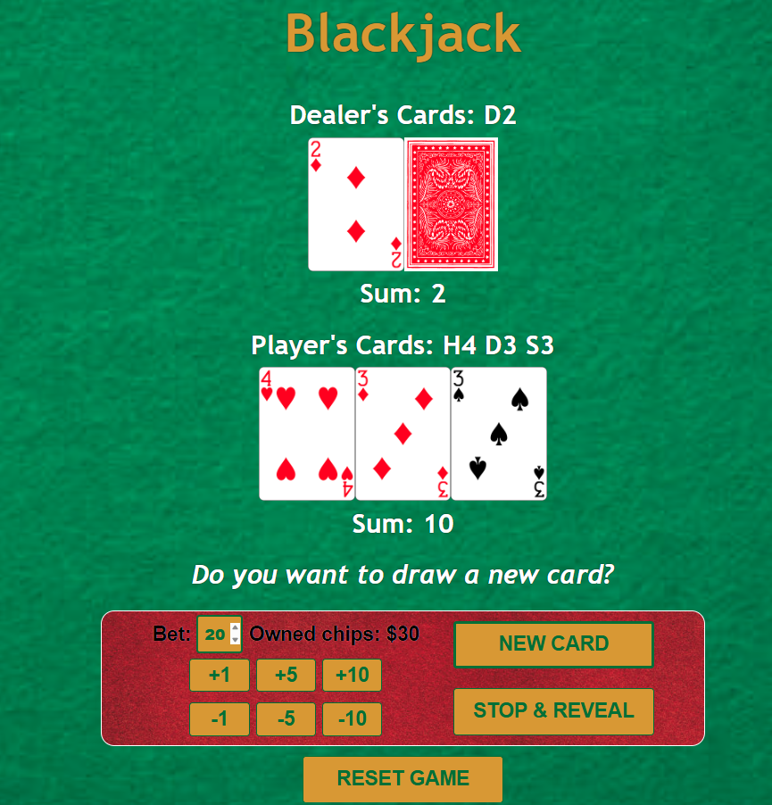
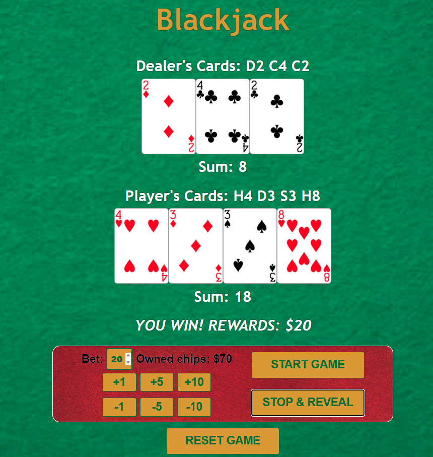

# Blackjack
A simple implementation of Blackjack that involves 1 player against a dummy dealer.

The initial state

The game in Progress

The game's ending state

## Description

### Game Rules
A simple self-implemented Blackjack game where the goal is to beat the dealer by getting as close to 21 as possible without going over. The complete rule of Blackjack can be found here: [How to play Blackjack by wikiHow](https://www.wikihow.com/Play-Blackjack).

### Implementation Differences against Actual Game Rules
* Only implement the single-player version (1 vs Dealer).
* Ace will always be treated as 11 as long as it does not cause a bust. For multiple aces, only the first one will be set as 11.
* The dealer is only dealt one card initially to prevent players from cheating by inspecting the JavaScript code to reveal the hidden second card.
* The blackjack win condition is applied only to the player and not to the dealer. (saved for**Future Implementation**)
* If the blackjack win condition is triggered, the player is awarded 1.5x of his bet (round down).

## Getting Started
The implementation of this game can be accessed here: [Blackjack by wengti](https://blackjack-wengti.netlify.app/).

The User Interface of this implementation is a mix of clickable buttons and input box.

Buttons:
* +1 / +5 / +10 / -1 / -5 / -10
    * Buttons to increment/decrement the bet by 1, 5 or 10 respectively.
* START GAME / NEW CARD
    * Button to be pressed to start the game. The game will only start if the placed bet is between 1 and the number of chips the player owns.
    * Once the game is started, it will be substituted as the button to **HIT** (to draw new card).
    * Once the game is over, it returns to being the button for triggering the start of the game, while also reset the game state.
* STOP & REVEAL
    * Button to be pressed to **STAY** (stop drawing new card and prompt the dealer to reveal hands and draw 1 more if the dealer's sum is less than 17)
    * It can only be pressed with effect if the game has been started.

Input box:
* The player can also manually enter the bet value in the input box next to "Bet: " in the player area.